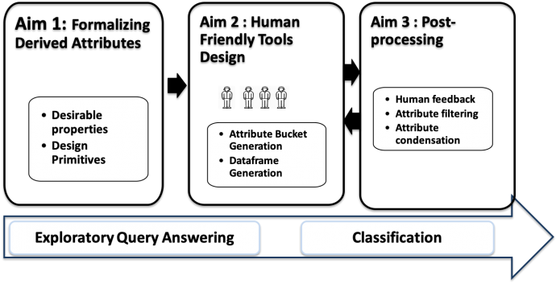

Attribute design is one of the most challenging aspects of the Big Data Science pipeline, where raw attributes need to be transformed into easily-interpretable attributes that can aid data scientists in ad-hoc data exploration and building predictive models. Unfortunately, current automated techniques for attribute design do not offer adequate interpretability to the end user, and attribute designed by human data scientists is painstakingly slow and heavily reliant on domain expertise. This project will develop a novel and transformative approach to enable an ensemble of amateur human workers to be involved in the computational loop for attribute  design. It will benefit various domains that require effective applications of Big Data Science.  The research involves developing a suite of algorithms and techniques for understanding the opportunities and challenges of involving an ensemble of human workers in attribute design, which is inspired by ensemble methods in Machine Learning. The main focus is on iterative methods to guide amateur human workers  even with limited domain expertise to suggest new attributes for data exploration and predictive modeling. The research makes fundamental advancements to engineering by integrating theoretically-proven attribute design algorithms with application-specific details of real-world data science tasks. A prototype will be rigorously evaluated involving datasets from several application domains and human workers. The outcomes of this research will spur significant research in next generation human-in-the-loop computing, as well as impact data exploration over huge, high dimensional and unfathomable datasets.  

