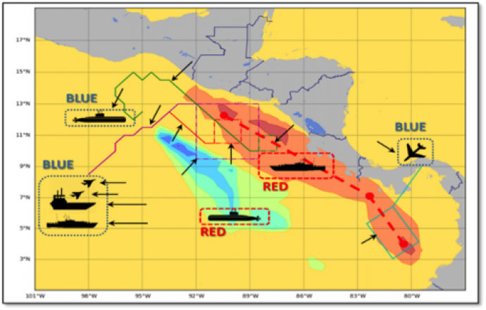

The key goal of this project is to enhance the synergy of hybrid human-machine teams to become more effective units, achievable via efficient multi-objective optimization algorithms for agile mission planning. The objective is to provide proactive, context-dependent decision support with enhanced operational capability under uncertainty, time pressure and resource constraints. The proposed decision support capabilities are applicable across a broad range of Navy-relevant missions impacted by uncertainty, such as ship/helicopter/UAV/submarine/aircraft carrier strike group routing, multi-domain battle management, and unmanned system coordination.   

