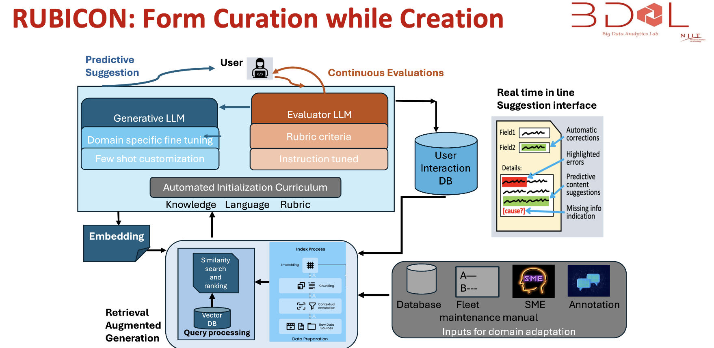

The goal of this project is to leverage Generative AI technology to improve the quality of unstructured text that pervasively exists across many key naval data sources. The overarching goal will be to assist the end users with suggested texts/ dropdowns as recommendations, which will minimize their data entry effort while giving rise to high quality unstructured text.  The desired solution will: 1) Generate a general purpose curation / creation text engine that facilitates completing a variety of text-based forms. 2) Describe a mechanism for incorporating technical terminology appropriate for a specific usage domains (potentially including sensitive or classified data).  __Funding source:__ Boston Fusion Corporation and Office of Naval Research.  
