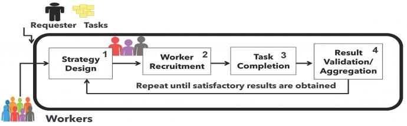

Crowdsourcing leverages online infrastructure to tap an under-explored and richly heterogeneous pool of human knowledge and cognition for solving a variety of tasks that are otherwise considered hard for machines to solve alone. Crowdsourcing systems are built on private or public platforms and are a popular means of deploying a variety of tasks that require human intelligence. Task deployment on crowdsourcing platforms requires identifying appropriate deployment strategies to satisfy deployment parameters, provided by requesters as thresholds on quality, latency, and cost, and also requires analysis of the workforce that is available to undertake the deployed tasks. To date, task deployment remains a painstakingly manual process, as there is little to no help for requesters in deciding how to organize the workforce, in what style, and in what structure to satisfy deployment parameters. Consequently, requesters and workers are mostly confined to one platform, as there is no easy portability of deployment processes across platforms. This project investigates a middle layer that sits between multiple stakeholders in a crowdsourcing ecosystem to aid requesters in deploying crowdsourcing tasks by allowing easy and flexible specification of deployment constraints and goals, and then recommending deployment strategies based on those specifications. Development of this framework thus enables the portability and reuse of deployment processes across platforms. 
